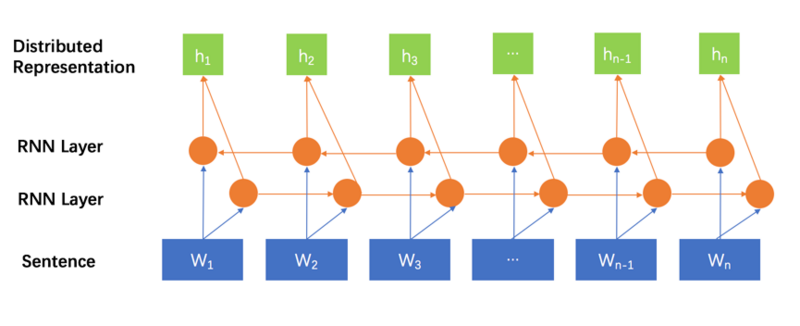
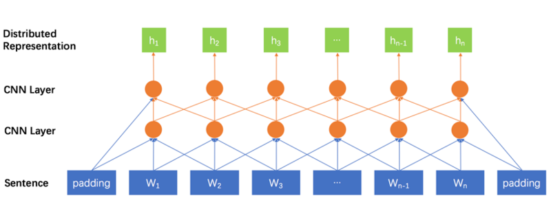
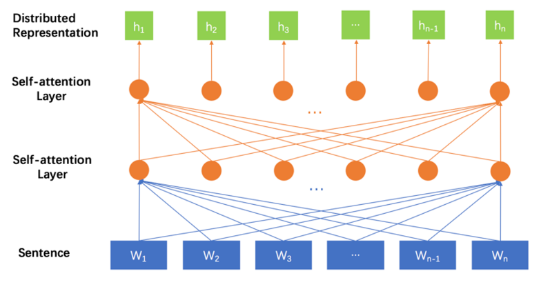
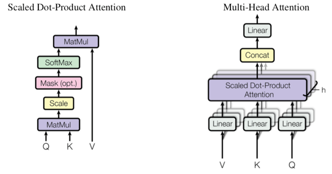
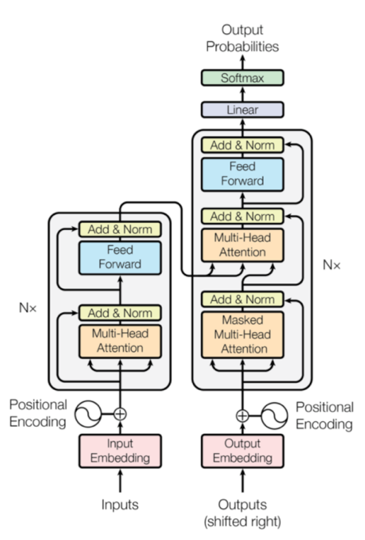
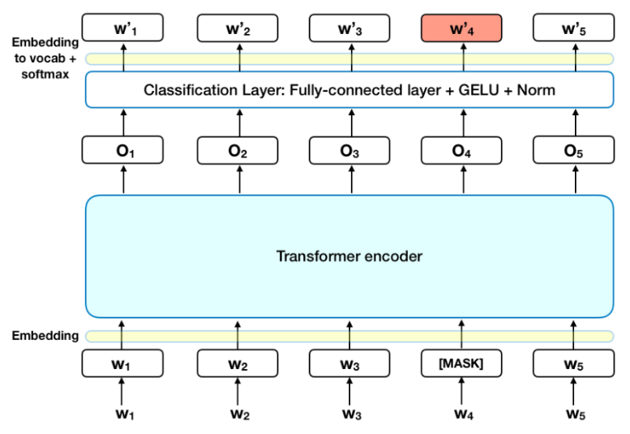
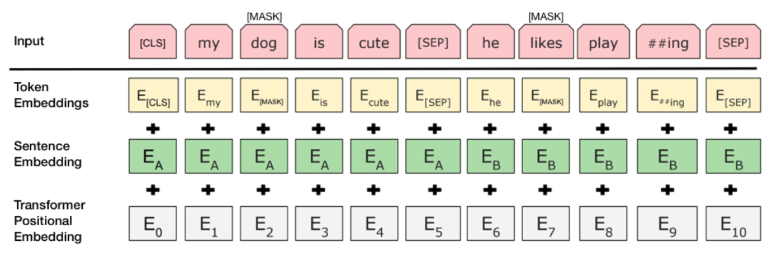
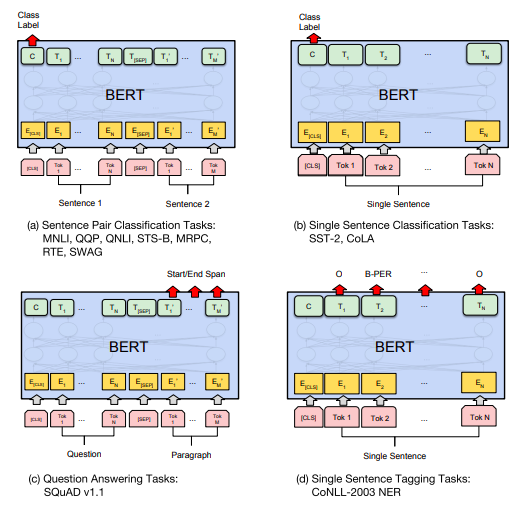

## 任务10：

1. Transformer的原理。
2. BERT的原理。
3. 利用预训练的BERT模型将句子转换为句向量，进行文本分类。 

**transformer 参考** ：

​	transformer github实现：https://github.com/Kyubyong/transformer

​	transformer pytorch分步实现：http://nlp.seas.harvard.edu/2018/04/03/attention.html

​	搞懂Transformer结构，看这篇PyTorch实现就够了：https://www.tinymind.cn/articles/3834

​	“变形金刚”为何强大：从模型到代码全面解析Google Tensor2Tensor系统：https://segmentfault.com/a/1190000015575985

**bert理论**：

​	bert系列1：<https://medium.com/dissecting-bert/dissecting-bert-part-1-d3c3d495cdb3>
​	bert系列2：<https://medium.com/dissecting-bert/dissecting-bert-part2-335ff2ed9c73>
​	bert系列3：<https://medium.com/dissecting-bert/dissecting-bert-appendix-the-decoder-3b86f66b0e5f>	

​	5 分钟入门 Google 最强NLP模型：BERT：https://www.jianshu.com/p/d110d0c13063

​	BERT – State of the Art Language Model for NLP：https://www.lyrn.ai/2018/11/07/explained-bert-state-of-the-art-language-model-for-nlp/

​	google开源代码：https://github.com/google-research/bert

**bert实践**：

​	干货 BERT fine-tune 终极实践教程：https://www.jianshu.com/p/aa2eff7ec5c1

​	小数据福音！BERT在极小数据下带来显著提升的开源实现：https://mp.weixin.qq.com/s?__biz=MzA3MzI4MjgzMw==&mid=2650752891&idx=5&sn=8a44293a57da96db51b9a13feb6223d7&chksm=871a8305b06d0a134e332a6831dbacc9ee79b28a79658c130fe6162f33211788cab18a55ec90&scene=21#wechat_redirect

​	BERT实战（源码分析+踩坑）：https://zhuanlan.zhihu.com/p/58471554

### Transformer

​	Transformer是一种建模序列的新方法，序列到序列的模型依然是沿用了上述经典的Encoder-Decoder结构，不同的是不再使用RNN或是CNN作为序列建模机制了，而是使用了self-attention机制。这种机制理论上的优势就是更容易捕获“长距离依赖信息（long distance dependency）”。所谓的“长距离依赖信息”可以这么来理解：

​	1）一个词其实是一个可以表达多样性语义信息的符号（歧义问题）。

​	2）一个词的语义确定，要依赖其所在的上下文环境。（根据上下文消岐）

​	3）有的词可能需要一个范围较小的上下文环境就能确定其语义（短距离依赖现象），有的词可能需要一个范围较大的上下文环境才能确定其语义（长距离依赖现象）。

RNN和CNN的对于长句子的弊端：

​	RNN：由于是对序列中的元素按顺序处理的，两个词之间的交互距离可以认为是他们之间的相对距离。W1和Wn之间的交互距离是n-1。带有门控（Gate）机制的RNN模型理论上可以对历史信息进行有选择的存储和遗忘，具有比纯RNN结构更好的表现，但是门控参数量一定的情况下，这种能力是一定的。随着句子的增长，相对距离的增大，存在明显的理论上限。

​	CNN：第一层的CNN单元覆盖的语义环境范围较小，第二层覆盖的语义环境范围会变大，依次类推，越深层的CNN单元，覆盖的语义环境会越大。一个词首先会在底层CNN单元上与其近距离的词产生交互，然后在稍高层次的CNN单元上与其更远一些词产生交互。所以，多层的CNN结构体现的是一种从局部到全局的特征抽取过程。词之间的交互距离，与他们的相对距离成正比。距离较远的词只能在较高的CNN节点上相遇，才产生交互。这个过程可能会存在较多的信息丢失。

​	

对于Transformer而言：

​	注意，为了使图展示的更清晰，少画了一些连接线，图中“sentence”层中的每个词和第一层self-attention layer中的节点都是全连接的关系，第一层self-attention layer和第二层self-attention layer之间的节点也都是全连接的关系。

​	**我们可以看到在这种建模方法中，任意两个词之间的交互距离都是1，与词之间的相对距离不存在关系。这种方式下，每个词的语义的确定，都考虑了与整个句子中所有的词的关系。多层的self-attention机制，使得这种全局交互变的更加复杂，能够捕获到更多的信息。**

### Self-attention机制的变种

​	Transformer里面的self-attention机制是一种新的变种，体现在两点，一方面是加了一个**缩放因子**（scaling factor），另一方面是引入了**多头机制**（multi-head attention）。

​	**缩放因子**体现在Attention的计算公式中多了一个向量的维度作为分母，目的是想避免维度过大导致的点乘结果过大，进入softmax函数的饱和域，引起梯度过小。

​	**多头机制**是指，引入多组的参数矩阵来分别对Q、K、V进行线性变换求self-attention的结果，然后将所有的结果拼接起来作为最后的self-attention输出。

### 位置编码（Positional Encoding）

​	self-attention机制建模序列的方式，会丢失词与词之间的相对距离关系。举个例子就是，“牛 吃了 草”、“草 吃了 牛”，“吃了 牛 草”三个句子建模出来的每个词对应的表示，会是一致的。

 	为了缓解这个问题，Transformer中将词在句子中所处的位置映射成vector，补充到其embedding中去。

​	一种直接的方式是，直接对绝对位置信息建模到embedding里面，即将词Wi的i映射成一个向量，加到其embedding中去(也就是最终输入向量= concat(位置向量，词向量))。这种方式的缺点是只能建模有限长度的序列。

​	Transformer文章中提出了一种非常新颖的时序信息建模方式，就是利用三角函数的周期性，来建模词之间的相对位置关系。具体的方式是将绝对位置作为三角函数中的变量做计算，具体公式如下：

 该公式的设计非常先验，尤其是分母部分，不太好解释。从笔者个人的观点来看，一方面三角函数有很好的周期性，也就是隔一定的距离，因变量的值会重复出现，这种特性可以用来建模相对距离；另一方面，三角函数的值域是[-1,1]，可以很好的提供embedding元素的值。

### 多层结构

​	左侧的Nx代表一层的Encoder，这一层中包含了两个子层（sub-layer），第一个子层是多头的self-attention layer，第二个子层是一个Feed Forward层。每个子层的输入和输出都存在着residual connection，这种方式理论上可以很好的回传梯度。Layer Normalization的使用可以加快模型的收敛速度。self-attention子层的计算，我们前面用了不少的篇幅讲过了，这里就不再赘述了。Feed Forward子层实现中有两次线性变换，一次Relu非线性激活，具体计算公式如下：

（就是两次全连接，最后一次不适用激活函数）

​	右侧是Decoder中一层的结构，这一层中存在三个子层结构，第一层是self-attention layer用来建模已经生成的目标端句子。在训练的过程中，需要一个mask矩阵来控制每次self-attention计算的时候，只计算到前t-1个词，具体的实现方式，我们会在后面讲代码实现的时候进行说明。第二个子层是Encoder和Decoder之间的attention机制，也就是去源语言中找相关的语义信息，这部分的计算与其他序列到序列的注意力计算一致，在Transformer中使用了dot-product的方式。第三个子层是Feed Forward层，与Encoder中的子层完全一致。每个子层也都存在着residual connection和layer normalization操作，以加快模型收敛。

### 优化方法与正则策略

​	1、**模型的训练采用了Adam方法** 。

​	2、**学习率**的调节方式采用以下公式：

​	公式比较先验，看上去比较复杂，其实逻辑表达起来比较清楚，需要预先设置一个warmup_steps超参。当训练步数step_num小于该值时，以括号中的第二项公式决定学习率，该公式实际是step_num变量的斜率为正的线性函数。当训练步数step_num大于warm_steps时，以括号中的第一项决定学习率，该公式就成了一个指数为负数的幂函数。所以整体来看，学习率呈先上升后下降的趋势，有利于模型的快速收敛。

​	3、**dropout**正则化：用在每个子层的后面和attention的计算中。

​	4、标签平滑处理**label smoothing** ：

​	也就是训练的时候，计算交叉熵的时候，不再是one-hot的标准答案了，而是每个0值处也填充上一个非0的极小值。这样可以增强模型的鲁棒性，提升模型的BLEU值。这个思路其实也是一定程度在解决训练和解码过程中存在的exposure bias的问题。

## BERT:

​	bert可以用来做什么：**可以用于问答系统，情感分析，垃圾邮件过滤，命名实体识别，文档聚类等任务中，作为这些任务的基础设施即语言模型。**

#### 	BERT 原理简述：

​	BERT 利用了 Transformer 的 encoder 部分。（ Transformer 是一种注意力机制，可以学习文本中单词之间的上下文关系的。Transformer 的原型包括两个独立的机制，一个 encoder 负责接收文本作为输入，一个 decoder 负责预测任务的结果。BERT 的目标是生成语言模型，所以只需要 encoder 机制Transformer 的 encoder 是一次性读取整个文本序列，而不是从左到右或从右到左地按顺序读取，这个特征使得模型能够基于单词的两侧学习，相当于是一个双向的功能。。）

​	当我们在训练语言模型时，有一个挑战就是要定义一个预测目标，很多模型在一个序列中预测下一个单词，
“The child came home from ___” 双向的方法在这样的任务中是有限制的，为了克服这个问题，

​	**BERT 使用两个策略:**	

1、 **Masked LM (MLM)**：（预测被mask的单词）

​	在将单词序列输入给 BERT 之前，每个序列中有 15％ 的单词被 [MASK] token 替换。 然后模型尝试基于序列中其他未被 mask 的单词的上下文来预测被掩盖的原单词。

1. 在 encoder 的输出上添加一个分类层

  		2. 用嵌入矩阵乘以输出向量，将其转换为词汇的维度
  		3. 用 softmax 计算词汇表中每个单词的概率

​	BERT 的损失函数只考虑了 mask 的预测值，忽略了没有掩蔽的字的预测。这样的话，模型要比单向模型收敛得慢，不过结果的情境意识增加了。

2、**Next Sentence Prediction (NSP)**：（判断第2个句子是否是第一个句子的下一句）

​	在 BERT 的训练过程中，模型接收成对的句子作为输入，并且预测其中第二个句子是否在原始文档中也是后续句子。在训练期间，50％ 的输入对在原始文档中是前后关系，另外 50％ 中是从语料库中随机组成的，并且是与第一句断开的。为了帮助模型区分开训练中的两个句子，输入在进入模型之前要按以下方式进行处理：

​	1、在第一个句子的开头插入 [CLS] 标记，在每个句子的末尾插入 [SEP] 标记。

​	2、将表示句子 A 或句子 B 的一个句子 embedding 添加到每个 token 上。

​	3、给每个 token 添加一个位置 embedding，来表示它在序列中的位置。

然后预测第二个句子是否是第一个句子的后续句子，用下面几个步骤来预测：

​	1、整个输入序列输入给 Transformer 模型

​	2、用一个简单的分类层将 [CLS] 标记的输出变换为 2×1 形状的向量

​	3、用 softmax 计算 IsNextSequence 的概率

### 如何使用 BERT?

BERT 可以用于各种NLP任务，只需在核心模型中添加一个层，例如：

​	1、在分类任务中，例如情感分析等，只需要在 Transformer 的输出之上加一个分类层

​	2、在问答任务（例如SQUAD v1.1）中，问答系统需要接收有关文本序列的 question，并且需要在序列中标记 answer。 可以使用 BERT 学习两个标记 answer 开始和结尾的向量来训练Q＆A模型。

​	3、在命名实体识别（NER）中，系统需要接收文本序列，标记文本中的各种类型的实体（人员，组织，日期等）。 可以用 BERT 将每个 token 的输出向量送到预测 NER 标签的分类层。

​	具体的，可以到github源码的readme里，有详细说明如何使用命令直接去训练：https://github.com/google-research/bert