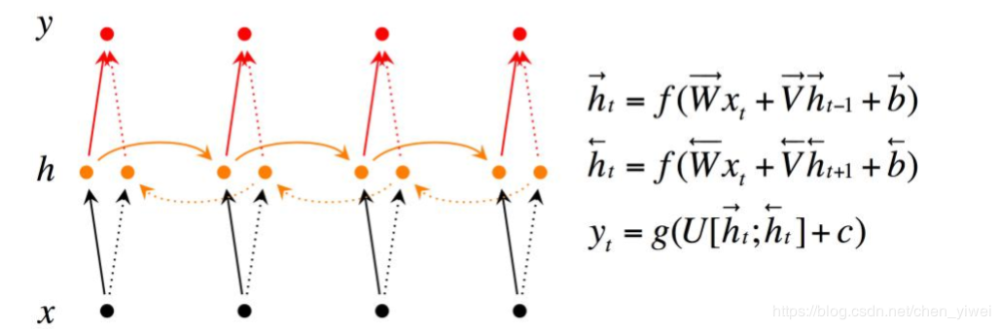

## 任务8：

1. RNN的结构。循环神经网络的提出背景、优缺点。着重学习RNN的反向传播、RNN出现的问题（梯度问题、长期依赖问题）、BPTT算法。
2. 双向RNN
3. 递归神经网络
4. LSTM、GRU的结构、提出背景、优缺点。
5. Memory Network（自选）
6. Text-RNN的原理。
7. 利用Text-RNN模型来进行文本分类。
8. Recurrent Convolutional Neural Networks（RCNN）原理。
9. 利用RCNN模型来进行文本分类（自选）

参考资料：

​	一份详细的LSTM和GRU图解：https://www.atyun.com/30234.html

​	Tensorflow实战(1): 实现深层循环神经网络：https://zhuanlan.zhihu.com/p/37070414

​	lstm：https://x-algo.cn/index.php/2017/01/13/1609/

​	RCNN tf (推荐)：https://github.com/roomylee/rcnn-text-classification/blob/master/rcnn.py

​	其它参考(很不错)：https://www.cnblogs.com/jiangxinyang/p/10208290.html

### RNN结构：

​	神经网络的模块A，正在读取某个输入 x_i，并输出一个值 h_i。循环可以使得信息可以从当前步传递到下一步。这些循环使得 RNN 看起来非常神秘。然而，如果你仔细想想，这样也不比一个正常的神经网络难于理解。RNN 可以被看做是同一神经网络的多次赋值，每个神经网络模块会把消息传递给下一个。

​	 链式的特征揭示了 RNN 本质上是与序列和列表相关的。他们是对于这类数据的最自然的神经网络架构。

​	先介绍一下各个符号的含义：x是输入，h是隐层单元，o为输出，L为损失函数，y为训练集的标签。这些元素右上角带的t代表t时刻的状态，其中需要注意的是，因策单元h在t时刻的表现不仅由此刻的输入决定，还受t时刻之前时刻的影响。V、W、U是权值，同一类型的权连接权值相同。

​	有了上面的理解，前向传播算法其实非常简单，对于t时刻： 

#### BPTT 随时间的反向传播算法：

​	BPTT（back-propagation through time）算法是常用的训练RNN的方法，其实本质还是BP算法，只不过RNN处理时间序列数据，所以要基于时间反向传播，故叫随时间反向传播。BPTT的中心思想和BP算法相同，沿着需要优化的参数的负梯度方向不断寻找更优的点直至收敛。综上所述，BPTT算法本质还是BP算法，BP算法本质还是梯度下降法，那么求各个参数的梯度便成了此算法的核心。 （根据RNN图2来辅助看公式） 

​	

#### 梯度消失：

​	在上面式子累乘的过程中，如果取sigmoid函数作为激活函数的话，那么必然是一堆小数在做乘法，结果就是越乘越小。随着时间序列的不断深入，小数的累乘就会导致梯度越来越小直到接近于0，这就是“梯度消失“现象。最终结果就是对应的参数更新时，近乎只是上下波动很小的值，可近似忽略不计，故此相当于没更新，没达到训练效果。

​	tanh函数也会产生梯度消失，但至少比sigmoid函数消失的要慢一些，梯度也比sigmoid大，故收敛更快点。且tanh时0中心对称的，均值为0。sigmoid不是以0中心对称，输出均大于0，故由偏移现象。

​	解决方案： 1、更换更优秀的激活函数。 2、改变网络结构(gru, lstm)

#### 梯度爆炸：

​	Relu函数：当x>0时，导数值恒等于1，这样的导数值很好的避免了梯度消失的问题，但是会容易导致梯度爆炸。

​	Relu会有个问题，就是其左侧x<0的导数值为0，故此会导致左侧的参数的更新值为0（即不更新了）。修改学习率可以稍微避免该问题

​	梯度爆炸解决方式：当梯度达到一定的阈值时，就进行截断。

#### 双向循环神经网络：

### LSTM:

### GRU:

其中：r门表示相关性，即计算出的下一个ht的候选值h^hat_t跟h_(t-1)由多大的相关性

### TextRNN:

以上为textrnn的示意图，采用2层rnn和2层全连接，以及最后的softmax分类。